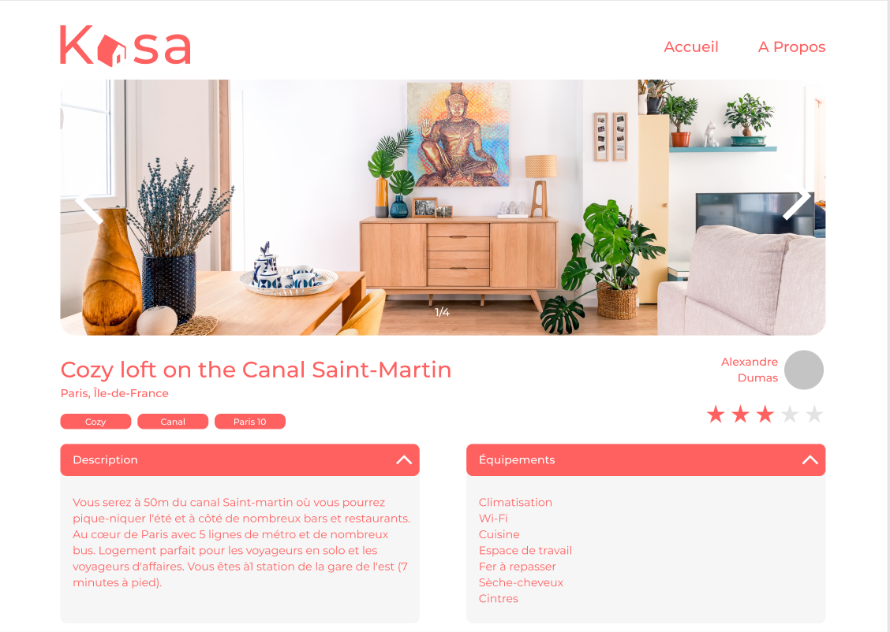

 Avec plus de 500 annonces postées chaque jour,
Kasa fait partie des leaders de la location d’appartements entre particuliers en France depuis près de 10 ans.

### Projet 7 d'OpenClassRooms :  Créez une application web de location immobilière avec React.

#### NPM START :  Lancement de l'application.

#### NPM RUN SERVER :  Lancement de la simulation du Backend avec json-server.

#### MODULES UTILISES DANS CE PROJET: -React-router-dom -Axios  -Sass  -json-server

